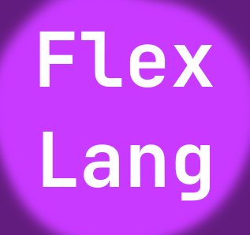

    

# FlexLang
FlexLang - my mini programing language. FlexLang is intended to be a scripting and object-oriented programming language. But so far its functionality is very small...but FlexLang will constantly evolve

The source code of the FlexLang programming language interpreter will be completely rewritten, using traditional standards for creating interpreters. These updates will be included in version 1.0.

Here are the innovations that will be in version FlexLang 1.0:
1. The interpreter source code will be completely rewritten
2. It will be possible to work with variables
